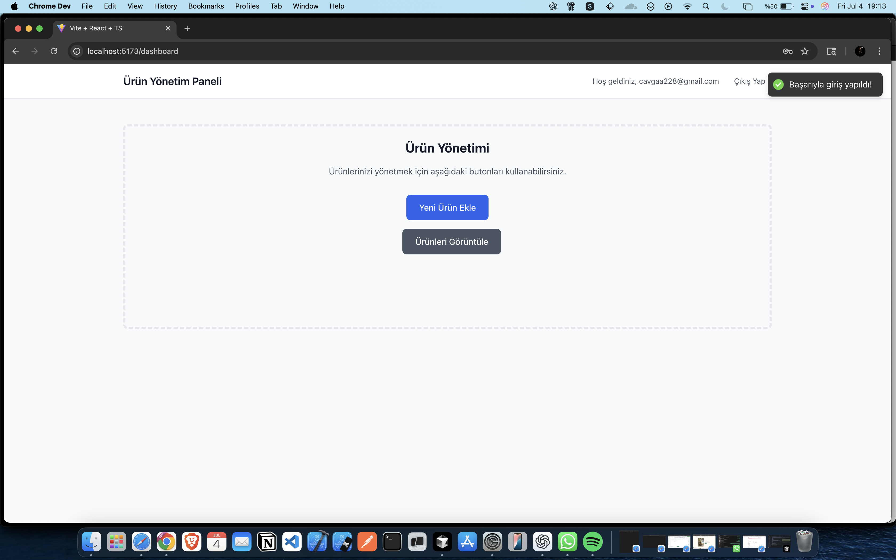

# React + Supabase Product Manager

Modern, responsive bir ürün yönetim paneli. React, TypeScript, Supabase ve Tailwind CSS kullanılarak geliştirilmiştir.

## 🚀 Özellikler

- **Kullanıcı Kimlik Doğrulama**: Güvenli giriş/kayıt sistemi
- **Ürün Yönetimi**: Ürün ekleme, görüntüleme ve yönetme
- **Resim Yükleme**: Supabase Storage ile resim yükleme
- **Responsive Tasarım**: Mobil ve masaüstü uyumlu
- **Form Validasyonu**: React Hook Form ile doğrulama
- **Toast Bildirimleri**: Başarı/hata mesajları
- **Korumalı Rotalar**: Kimlik doğrulama gerektiren sayfalar

## 📱 Uygulama Ekran Görüntüleri

### 🔐 Giriş Sayfası


### ❌ Hata Yönetimi


### 🏠 Dashboard


### ➕ Ürün Ekleme


### 📦 Ürün Listesi


## 🛠️ Teknolojiler

- **Frontend**: React 18 + TypeScript + Vite
- **Backend**: Supabase (Database + Auth + Storage)
- **Styling**: Tailwind CSS
- **Routing**: React Router DOM
- **Forms**: React Hook Form
- **Notifications**: React Hot Toast

## 📋 Kurulum

1. **Proje klonlama**:
   ```bash
   git clone https://github.com/Cavga1903/react-supabase-product-manager.git
   cd react-supabase-product-manager
   ```

2. **Bağımlılıkları yükleme**:
   ```bash
   npm install
   ```

3. **Çevre değişkenlerini ayarlama**:
   ```bash
   cp env.example .env
   ```
   `.env` dosyasını kendi Supabase bilgilerinizle güncelleyin.

4. **Geliştirme sunucusunu başlatma**:
   ```bash
   npm run dev
   ```

## 🏗️ Proje Yapısı

```
src/
├── components/
│   └── auth/
│       ├── Login.tsx
│       ├── Signup.tsx
│       └── ProtectedRoute.tsx
├── contexts/
│   └── AuthContext.tsx
├── features/
│   └── products/
│       └── AddProduct.tsx
├── lib/
│   └── supabase.ts
├── pages/
│   ├── Dashboard.tsx
│   └── Products.tsx
├── App.tsx
└── main.tsx
```

## 🗄️ Veritabanı Yapısı

### Products Tablosu
```sql
CREATE TABLE products (
  id UUID DEFAULT uuid_generate_v4() PRIMARY KEY,
  name VARCHAR NOT NULL,
  description TEXT,
  price DECIMAL(10,2) NOT NULL,
  image_url TEXT,
  user_id UUID REFERENCES auth.users(id),
  created_at TIMESTAMP WITH TIME ZONE DEFAULT NOW()
);
```

### Storage Bucket
```sql
-- product-images bucket for storing product images
INSERT INTO storage.buckets (id, name, public) VALUES ('product-images', 'product-images', true);
```

## 🚀 Deployment

### Vercel
```bash
npm run build
# Deploy to Vercel
vercel --prod
```

### Netlify
```bash
npm run build
# Deploy dist folder to Netlify
```

## 📝 API Endpoints

### Authentication
- `POST /auth/signup` - Kullanıcı kaydı
- `POST /auth/signin` - Kullanıcı girişi
- `POST /auth/signout` - Çıkış yapma

### Products
- `GET /products` - Kullanıcının ürünlerini listele
- `POST /products` - Yeni ürün ekle
- `PUT /products/:id` - Ürün güncelle
- `DELETE /products/:id` - Ürün sil

### Storage
- `POST /storage/product-images` - Ürün resmi yükle

## 🔧 Yapılandırma

### Supabase Setup
1. [Supabase](https://supabase.com) hesabı oluşturun
2. Yeni proje oluşturun
3. `supabase-setup.sql` dosyasını SQL Editor'da çalıştırın
4. Storage bucket'ını ayarlayın
5. RLS (Row Level Security) politikalarını aktifleştirin

### Environment Variables
```env
VITE_SUPABASE_URL=your_supabase_url
VITE_SUPABASE_ANON_KEY=your_supabase_anon_key
```

## 🤝 Katkıda Bulunma

1. Fork yapın
2. Feature branch oluşturun (`git checkout -b feature/amazing-feature`)
3. Commit yapın (`git commit -m 'Add amazing feature'`)
4. Push yapın (`git push origin feature/amazing-feature`)
5. Pull Request oluşturun

## 📄 Lisans

Bu proje [MIT](LICENSE) lisansı altında lisanslanmıştır.

## 👨‍💻 Geliştirici

- **Cavga1903** - [GitHub](https://github.com/Cavga1903)

## 🙏 Teşekkürler

- [Supabase](https://supabase.com) - Backend as a Service
- [React](https://reactjs.org) - UI Framework
- [Tailwind CSS](https://tailwindcss.com) - CSS Framework
- [Vite](https://vitejs.dev) - Build Tool

---

⭐ Bu projeyi beğendiyseniz yıldız vermeyi unutmayın!
